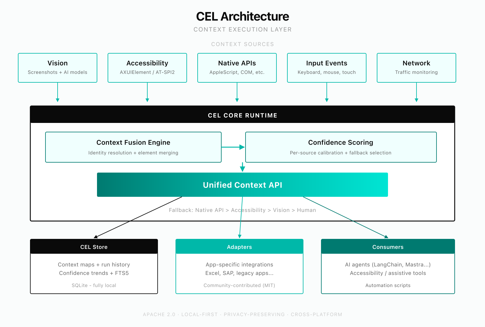

<div align="center">

# Cellar

### The computer use runtime for AI agents that actually ships.

**Best-in-class hybrid perception. Native macOS. MCP server for Claude Code, Cursor, and every tool that speaks the protocol.**

[Quickstart](docs/quickstart.md) · [Connect to Claude Code](docs/connect-claude-code.md) · [Architecture](docs/architecture.md) · [FAQ](docs/faq.md)

</div>

---

## Why Cellar exists

Every agent that operates a computer today fights the same losing battle: feed screenshots to a vision model, hope it can find the button, hope it can tell when something changed, hope it doesn't loop forever when a modal pops up. It's expensive, slow, and wrong often enough that real workflows break.

Cellar takes a different approach. **We read what's actually on the screen** — through accessibility trees, Chrome DevTools Protocol, and native APIs — and fall back to vision only when structure fails. The result is an agent runtime that handles the workflows screenshot-only agents can't touch.

## What makes Cellar different

<table>
<tr>
<td width="33%">

### Hybrid perception
Accessibility + CDP + native APIs + vision, fused into one structured context stream with per-element confidence scores. Structure first, vision as backup — not the other way around.

</td>
<td width="33%">

### Continuous awareness
The Cortex engine tracks **what changed**, not just what's there. Freshness model (fresh / soft-stale / hard-stale) prevents acting on outdated state. Side effects get caught and reported, not ignored.

</td>
<td width="33%">

### Works beyond the browser
Native macOS apps, terminals, Excel, Finder — anywhere there's an accessibility tree. One runtime, one protocol, one set of tools. Your agent doesn't need a different product for every surface.

</td>
</tr>
</table>

## The core claim

| | Screenshot-only agents | Browser-only runtimes | **Cellar** |
|---|---|---|---|
| Browser automation | ⚠ LLM-guided pixels | ✅ CDP + DOM | ✅ CDP + DOM + a11y fusion |
| Native macOS apps | ❌ | ❌ | ✅ AXUIElement |
| Browser → desktop handoff | ❌ Agent gets lost | ❌ Out of scope | ✅ Cortex continues in native app |
| Stale state detection | ❌ Clicks phantom buttons | ⚠ Depends on client | ✅ Freshness model |
| Cost per action | 💸 Every step = vision call | 💰 DOM is cheap | 💰 Structure first, vision only when needed |
| Runs offline | ❌ | ❌ | ✅ Local models (Ollama, Gemma 4) |
| MCP-native | ❌ | ⚠ Some wrappers | ✅ First-class, ships as MCP server |

## Install in two minutes

```bash
git clone https://github.com/dimpagk92/cellar.git && cd cellar
pnpm install && pnpm -r build
cargo build --release -p cel-napi
cp target/release/libcel_napi.dylib cel/cel-napi/cel-napi.darwin-arm64.node
codesign -fs - cel/cel-napi/cel-napi.darwin-arm64.node
cellar init          # interactive setup: pick LLM provider or install local Gemma 4
```

Then add Cellar to your MCP client — see [docs/connect-claude-code.md](docs/connect-claude-code.md) for Claude Code, Cursor, or any MCP-compatible tool.

No cloud. No telemetry. Your keys stay on your machine.

## What you get: 4 MCP tools, one runtime

| Tool | What it does | Modes |
|------|-------------|-------|
| **`cel_see`** | Read the screen — structured elements with types, labels, bounds, confidence | 14 modes |
| **`cel_act`** | Click, type, scroll, drag — by coordinates, element ID, or accessibility API | 11 actions + CDP eval |
| **`cel_think`** | Plan, remember, track runs, autonomous execution (`run_goal`) | 16 modes |
| **`cel_perceive`** | Always-on perception engine (Cortex) — continuous screen awareness | 7 modes |

On startup, the Cortex boots automatically (screen model is warm before your first call) and Chrome CDP is auto-detected. See [docs/mcp-server.md](docs/mcp-server.md) for the full tool reference.

## Benchmarks

CEL is measured on a broad mix of browser and cross-app tasks drawn from WebArena, VisualWebArena, and the hybrid suite we maintain for workflows that cross the browser-to-native boundary. We publish failure analysis, not just aggregate scores — see [docs/quickstart.md](docs/quickstart.md) to run the eval locally.

Results of note:

- **100% on the hybrid suite** — the tasks that cross the browser-to-native boundary. To our knowledge no other OSS runtime completes this class of task.
- **Context extraction in 100–400ms** for 500+ elements, no LLM required — vision-first approaches spend an order of magnitude more per step.
- **Model-agnostic**. The same scores hold across Gemini 2.0 Flash, Claude Sonnet, and local Gemma 4 E4B for most workflows.

## Architecture

<p align="center">
  
</p>

```
cellar/
  cel/                  ← Cortex + perception layer (Rust)
    cel-accessibility/  ← accessibility bridge (AXUIElement, AT-SPI2)
    cel-cortex/         ← continuous awareness + world model + freshness
    cel-context/        ← unified context API + multi-source fusion
    cel-cdp/            ← Chrome DevTools Protocol adapter
    cel-display/        ← screen capture
    cel-input/          ← input injection
    cel-vision/         ← vision model integration (multi-provider)
    cel-network/        ← traffic monitoring + idle detection
    cel-llm/            ← LLM provider abstraction
    cel-planner/        ← observe-plan-act loop
    cel-goal-runner/    ← autonomous goal execution
    cel-napi/           ← Node.js native bindings
  agent/                ← strategy router + goal runner (TypeScript)
  mcp-server/           ← MCP server — `cel_see` / `cel_act` / `cel_think` / `cel_perceive`
  adapters/             ← application adapters — browser bundled; see docs/building-adapters.md
  cli/                  ← `cellar` CLI
```

Deep dive in [docs/architecture.md](docs/architecture.md).

## Platform support

| Platform | Status |
|---|---|
| **macOS** | Production-ready. AXUIElement bridge, Cortex, MCP server all fully functional. |
| **Linux** | Working — AT-SPI2 accessibility bridge, CDP, input injection. |
| **Windows** | Planned — UI Automation bridge designed, not yet implemented. |

## Who should use Cellar

- **MCP tool builders** who need structured screen context for Claude, Cursor, or any MCP-native client
- **Agent framework authors** who've hit the ceiling of screenshot-only approaches
- **Builders of real workflows** that cross the browser-to-desktop boundary — finance data entry, CRM automation, spreadsheet+browser pipelines
- **Privacy-sensitive teams** who need a computer-use runtime that works with local models and never phones home

If you're building toy demos, a vision-only API from a model provider is fine. If you're building something users depend on, you'll eventually need what Cellar provides.

## Roadmap

The [full roadmap](docs/ROADMAP.md) tracks remote workers, worker protocol, Docker images, production hardening, and managed cloud. The short version:

- **Now** — macOS native, MCP server, browser adapter, 4 core tools
- **Next 4–8 weeks** — stable worker protocol + `cellar/worker` Docker image for browser-only workloads
- **Next 2–3 months** — production-ready remote (TLS, metrics, rate limiting)
- **Beyond** — managed cloud, macOS-in-cloud workers, community adapter marketplace

## Contributing

We welcome contributions — especially:
- Accessibility bridges (Windows UI Automation, mobile)
- New application adapters — see [docs/building-adapters.md](docs/building-adapters.md)
- MCP tool improvements
- Test coverage for platform-specific code
- Docs, tutorials, examples

Start with [CONTRIBUTING.md](CONTRIBUTING.md) and [DEVELOPMENT.md](DEVELOPMENT.md). For your first issue, look for anything tagged `good-first-issue`.

## Community

- [GitHub Discussions](https://github.com/dimpagk92/cellar/discussions) — questions, ideas, show-and-tell
- [Issues](https://github.com/dimpagk92/cellar/issues) — bugs and feature requests

## License

Apache License 2.0 — see [LICENSE](LICENSE). Community adapters under [adapters/](adapters/) are MIT.
