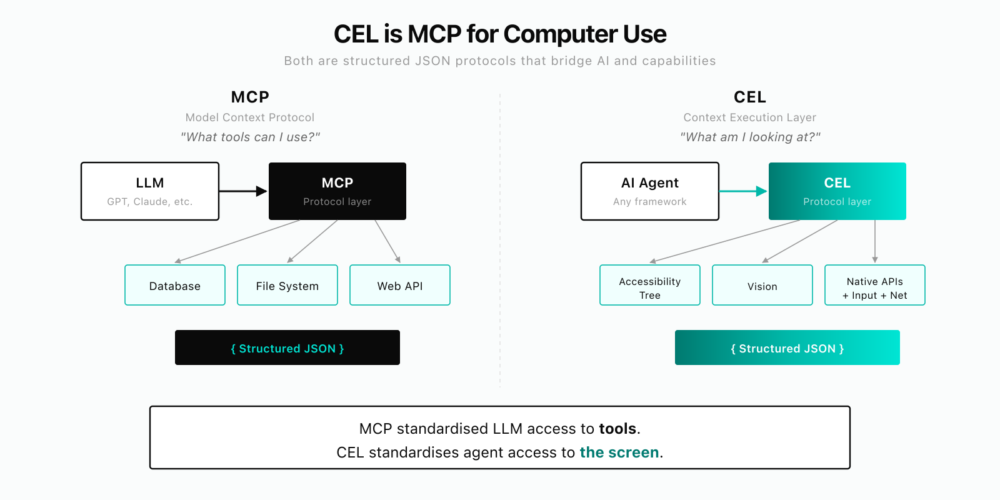
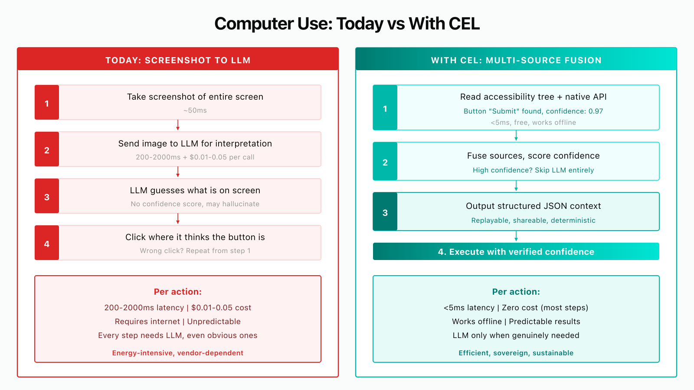

# cellar

**We handle the workflows that break when all you have is screenshots.**

CEL (Context Execution Layer) is an open-source computer use runtime that fuses accessibility trees, CDP, and vision into one structured perception layer. Where screenshot-only agents guess at pixels, CEL reads what's actually on screen — and knows when things change.

> **Status: Active development.** Core runtime fully functional on macOS. MCP server with 4 composable tools. Linux support available. Windows planned.

## Hybrid Runtime: What It Handles That Screenshots Can't

| Scenario | Screenshot Agents | CEL |
|----------|------------------|-----|
| **Browser → Desktop handoff** | Lose track when focus leaves the browser | Cortex detects context shift via a11y, continues in native app |
| **Stale state** (dynamic content changes between read and act) | Act on where the button *was* | Freshness model detects staleness, re-reads before acting |
| **Ambiguous targets** (8 identical "Delete" buttons) | ~12.5% chance of clicking the right one | a11y tree resolves by label, role, and structural context |
| **Unintended side effects** (unexpected modal/popup) | Get stuck or blindly click through | Cortex catches the side effect, records it, agent recovers |
| **Impossible actions** (auth-blocked, disabled) | Loop forever or timeout | Escalation ceiling: structured → semantic → vision → terminal stop |

Run these scenarios yourself: `./scripts/demo.sh` — see [DEMO.md](DEMO.md) for the full walkthrough.

<p align="center">
  
</p>

## What Makes CEL Different

- **Structure-first perception** — reads what's actually on screen through OS-level APIs, not what pixels look like. Vision is the fallback, not the foundation.
- **Hybrid runtime with strategy router** — per-action routing: structured → semantic → vision → refresh → terminal failure. Escalation ceiling prevents infinite loops.
- **Continuous awareness** — Cortex tracks what *changed*, not just what's there now. Freshness model (fresh / soft-stale / hard-stale) prevents acting on stale state.
- **Works everywhere** — browsers, desktop apps, terminals, legacy software. One runtime, not separate products for browser vs. desktop.
- **Model-agnostic** — works with any LLM. Sends structured text, not screenshots. A local 7B model works for most workflows.
- **200x cheaper** — structured context extraction eliminates expensive vision model inference on every step.

## The Problem

Agentic computer use — AI that operates software through the UI — is the defining trend in AI. But it does not work reliably yet.

In browsers, agents have the DOM but still produce unstable results because they depend entirely on LLM interpretation. Outside the browser — on desktop apps, terminals, native software — it's far worse. Agents rely on screenshots alone, feeding pixels to vision models and hoping they correctly identify buttons, fields, and values.

Meanwhile, rich structured information already exists on every computer: accessibility trees, native application APIs, network traffic, input events. No tool combines these signals into a standard format that any agent can consume.

MCP solved this problem for tool access. **CEL solves it for computer use.**

<p align="center">
  
</p>

## The Solution: CEL

CEL (Context Execution Layer) is both a context extraction and execution layer. It fuses five streams into a single structured JSON output with per-element confidence scoring:

| Stream | What it provides |
|---|---|
| **Vision** | Screen capture + vision model analysis |
| **Accessibility tree** | Platform APIs (AT-SPI2, AXUIElement, UIA) |
| **Native API bridge** | App-specific adapters (Excel COM, SAP Scripting, etc.) |
| **Input layer** | Mouse/keyboard — injected, intercepted, logged, replayable |
| **Network layer** | Traffic monitoring for state change detection |

The agent calls `getContext()` and gets structured JSON with confidence scores — regardless of which source provided the data. Then it executes actions through CEL using the same multi-source approach. Workflows become replayable sequences of structured contexts and actions, not brittle screenshot-to-click chains.

Works on any interface: browser, terminal, Finder, Excel, SAP, Bloomberg — any OS, any application.

Unlike screenshot-only approaches that route every action through expensive LLM inference, CEL uses structured sources (accessibility tree, native APIs) first and escalates to vision models only when needed. Faster, cheaper, more predictable — and capable of running fully offline.

## Use CEL with Claude Code (MCP)

CEL ships as an MCP server with 4 tools. Connect it to Claude Code, Cursor, or any MCP client:

```bash
# Build everything
pnpm install && pnpm -r build

# Build native module (macOS)
cargo build --release -p cel-napi
cp target/release/libcel_napi.dylib cel/cel-napi/cel-napi.darwin-arm64.node
codesign -fs - cel/cel-napi/cel-napi.darwin-arm64.node
```

Pick an LLM provider — the fastest path is the interactive setup (writes `~/.cellar/config.toml`):

```bash
dilipod init
```

Options: paste a Gemini / Anthropic / OpenAI API key, or install **Gemma 4 E4B** locally via Ollama for fully-private runs. If you'd rather configure via `.mcp.json` directly (see below), skip `init`.

### Configuration hierarchy

Environment variables override `~/.cellar/config.toml`, which overrides compiled defaults.

```toml
# ~/.cellar/config.toml
[llm]
provider = "gemini"          # openai | anthropic | gemini | ollama | compatible
api_key  = "your-key"
model    = "gemini-2.0-flash"

[audio]                      # optional — enables audio transcription in the Cortex
whisper_endpoint = "https://api.openai.com/v1/audio/transcriptions"
whisper_api_key  = "sk-..."
whisper_model    = "whisper-1"
# whisper_language = "en"   # ISO 639-1 hint — improves accuracy
```

Full variable list: [docs/api-reference.md](docs/api-reference.md#environment-variables).

Add to `.mcp.json` in your project root:

```json
{
  "mcpServers": {
    "cellar": {
      "command": "node",
      "args": ["/path/to/cellar/mcp-server/dist/index.js"],
      "env": {
        "CEL_LLM_PROVIDER": "gemini",
        "CEL_LLM_API_KEY": "your-api-key",
        "CEL_LLM_MODEL": "gemini-2.0-flash"
      }
    }
  }
}
```

Restart Claude Code and you'll have four tools:

| Tool | What it does | Modes/Actions |
|------|-------------|---------------|
| **cel_see** | Read the screen — structured elements with types, labels, bounds, confidence scores | 14 modes |
| **cel_act** | Click, type, scroll, drag — by coordinates, element ID, or accessibility API | 11 actions + CDP eval |
| **cel_think** | Plan, remember, track runs, autonomous execution (run_goal) | 16 modes |
| **cel_perceive** | Always-on perception engine (Cortex) — continuous screen awareness | 7 modes |

On startup, the Cortex boots automatically (screen model is warm before your first call) and Chrome CDP is auto-detected.

See [docs/quickstart.md](docs/quickstart.md) for the full setup guide and [docs/mcp-server.md](docs/mcp-server.md) for the complete tool reference.

## Current State

Cellar is in **prototype phase** on macOS. The bar for exit is defined in
[docs/PROTOTYPE_EXIT_CRITERIA.md](docs/PROTOTYPE_EXIT_CRITERIA.md); the curated
regression suite that gates it lives in [eval/prototype-subset/](eval/prototype-subset/).

**Gated today (macOS local):**
- Local execution on macOS via AX + CDP + screen capture + input injection
- MCP server with 4 composable tools: `cel_see` / `cel_act` / `cel_think` / `cel_perceive`
- Cortex — always-on perception with background event streams
- Autonomous execution (`run_goal`) over the prototype scenario suite: browser happy-paths, grounding, ambiguity, recovery, browser-to-desktop handoff
- CLI entry points: `dilipod init` (setup) and `dilipod run-goal "<goal>"`
- BYOK providers (OpenAI, Anthropic, Gemini) and local Ollama (Gemma 4 E4B default)
- Per-role LLM routing — Planner / Observer / Vision / Validator

**Built but outside this release's scope:**
- Audio capture + Whisper transcription fused into the Cortex world model
- Embedded SQLite + FTS5 for memory / semantic search
- napi-rs Rust ↔ Node.js bridge

**Later phase — explicitly not prototype work** (see [docs/ROADMAP.md](docs/ROADMAP.md)):
- Linux accessibility (AT-SPI2) and Windows UI Automation bridges
- Remote worker / Docker image / managed VMs (`cellar-worker/` exists in-tree as a preview; not wired into prototype gates)
- Managed cloud, control plane, billing
- Production confidence calibration
- Portable context maps, community workflow registry

## Architecture

<p align="center">
  
</p>

```
cellar/
  cel/                  ← Cortex + perception layer (Rust, Apache 2.0)
    cel-accessibility/  ← accessibility bridge (AXUIElement, AT-SPI2)
    cel-context/        ← unified context API + multi-source fusion + references
    cel-cortex/         ← continuous awareness + world model + freshness
    cel-cdp/            ← Chrome DevTools Protocol adapter
    cel-display/        ← screen capture (xcap)
    cel-input/          ← input injection (enigo)
    cel-vision/         ← vision model integration (multi-provider)
    cel-network/        ← traffic monitoring + idle detection
    cel-store/          ← embedded SQLite + FTS5 (memory, knowledge)
    cel-llm/            ← LLM provider abstraction
    cel-planner/        ← LLM-driven observe-plan-act loop
    cel-goal-runner/    ← autonomous goal execution loop
    cel-napi/           ← Node.js native bindings (napi-rs)
  agent/                ← strategy router + goal runner (TypeScript)
  mcp-server/           ← MCP server (4 tools: see/act/think/perceive)
  adapters/             ← application adapters — browser bundled; see docs/building-adapters.md
  cli/                  ← `dilipod` CLI
```

## Getting Started

### Quickstart — Claude Code (recommended)

See [docs/quickstart.md](docs/quickstart.md) for the full step-by-step guide. The short version:

```bash
# 1. Build
pnpm install && pnpm -r build
cargo build --release -p cel-napi
cp target/release/libcel_napi.dylib cel/cel-napi/cel-napi.darwin-arm64.node
codesign -fs - cel/cel-napi/cel-napi.darwin-arm64.node

# 2. Configure .mcp.json (see quickstart for full config)

# 3. Grant Accessibility permissions in System Settings

# 4. Restart Claude Code — tools are ready
```

### Quickstart — see what the agent sees

No Rust build needed. Just Node.js 20+ and pnpm:

```bash
pnpm install && pnpm -r build
npx tsx examples/quickstart.ts https://github.com/login
```

This launches a browser, extracts DOM elements as structured `ContextElement`s with confidence scores, and shows what the LLM planner would receive.

### Prerequisites

- Node.js 20+ and pnpm 9+ (TypeScript packages)
- Rust 1.75+ (CEL core, accessibility bridge, native bindings)
- macOS 13+ with Accessibility permissions
- Chrome (optional, for CDP features)

### Build

```bash
# Build everything
make build

# Or separately
make build-rust    # cargo build --workspace
make build-ts      # pnpm install && pnpm build

# Run tests
make test
```

### CLI

```bash
dilipod init                    # Interactive first-run setup (pick LLM provider or install Gemma 4)
dilipod setup                   # Configure AX + CDP permissions on this machine
dilipod context                 # Show unified context with confidence scores
dilipod context --json          # Output raw JSON
dilipod context --watch         # Live-update context in terminal
dilipod capture                 # Capture screenshot to file
dilipod action click 500 300    # Click at coordinates
dilipod action type "Hello"     # Type text
dilipod action key Enter        # Press a key
dilipod action combo Ctrl C     # Key combination
dilipod mcp                     # Start MCP server (stdio)
dilipod mcp install             # Print Claude Desktop config
dilipod run <workflow>          # Execute a saved workflow
dilipod train                   # Enter training mode
```

## Benchmarks

### Hybrid Runtime Scenarios (CEL advantage)

5 scenarios designed to test where multi-source perception matters. Run them: `./scripts/demo.sh`

| Scenario | What breaks screenshot agents | CEL metric |
|----------|------------------------------|------------|
| Browser → Desktop handoff | Lose context across app boundary | `sideEffectWarnings` |
| Stale state (2s shuffle) | Click where button *was* | `staleRecoveries`, `refreshRoutes` |
| Ambiguous targets (8 similar names) | Can't distinguish identical buttons | `semanticRoutes` |
| Side-effect detection (unexpected modal) | Stuck or blindly proceed | `sideEffectWarnings` |
| Terminal failure (auth-blocked) | Loop forever | `terminalFailures` |

### General Web Tasks

We also benchmark on 50+ general web tasks against other tools:

| Tool | Approach |
|------|----------|
| **Cellar** | Multi-source fusion (DOM + a11y + vision + network), confidence scoring, incremental updates |
| **Anthropic Computer Use** | Screenshot-only, pixel-coordinate actions via API |
| **Browser-Use (OSS)** | Hybrid screenshot + DOM (Python) |
| **Browserbase + Stagehand** | Cloud CDP + AI SDK |
| **Browser-Use Cloud** | Managed browser-use + custom model |

<!-- BENCHMARK_RESULTS_START -->
> Measured on Apple M-series (arm64, 12 cores, 18GB RAM), April 2026.
> Hybrid suite: 5 tasks testing browser-desktop handoff, stale state recovery, ambiguous targets, side-effect detection, terminal failure.
> All local tools use Gemini 2.5 Flash. Computer Use locked to Claude Sonnet.

### Benchmark results (April 2026 — Hybrid Suite, 5 tasks)

| Tool | Avg Time | LLM Calls | Cost/Task | Success |
|------|----------|-----------|-----------|---------|
| **CEL** | **20.8s** | **1.4** | **$0.0005** | **100%** |
| Browser-Use OSS | 23.4s | 3.0 | $0.001 | 100% |
| Stagehand v3 | 35.6s | 18.2 | $0.005 | 20% |
| Computer Use | 36.2s | 6.2 | $0.155 | 100% |
| Browser-Use Cloud | 46.5s | 5.6 | $0.003 | 100% |

**CEL vs the field:**

| vs | Speed | Cost | Accuracy |
|----|-------|------|----------|
| Computer Use (Anthropic) | **1.7x faster** | **310x cheaper** | Same (100%) |
| Browser-Use Cloud | **2.2x faster** | **6x cheaper** | Same (100%) |
| Stagehand v3 | **1.7x faster** | **10x cheaper** | **5x better** (100% vs 20%) |
| Browser-Use OSS | **1.1x faster** | **2x cheaper** | Same (100%) |

**Why CEL wins:**

- **1 LLM call per task** — structured context means most tasks extract data in a single pass. Competitors need 3-18 calls.
- **$0.0005/task** — Gemini Flash + context distillation. At 1000 tasks: CEL $0.50 vs Computer Use $155.
- **Structured context is free** — 500+ elements extracted in 100-400ms via Rust-native DOM fusion, no LLM required.
- **Full Rust execution loop** — perceive, plan, execute, verify all in Rust. No FFI in the hot path.
- For building reliable automation (not one-off tasks), structured context is the foundation
<!-- BENCHMARK_RESULTS_END -->

## Roadmap

The forward plan lives in [docs/ROADMAP.md](docs/ROADMAP.md). Deployment topology (local / remote worker / managed cloud, Docker scope, model backends) is in [docs/deployment.md](docs/deployment.md).

## Contributing

See [CONTRIBUTING.md](CONTRIBUTING.md) for how to get started, and [DEVELOPMENT.md](DEVELOPMENT.md) for build instructions and conventions.

We welcome contributions — especially:
- Accessibility bridges (macOS AXUIElement, Windows UI Automation)
- New application adapters — see [docs/building-adapters.md](docs/building-adapters.md)
- MCP tool improvements
- Test coverage for platform-specific code
- Documentation and examples

## Platform Support

| Platform | Status |
|---|---|
| macOS | Primary platform. AXUIElement bridge, Cortex, MCP server — all fully functional. |
| Linux | AT-SPI2 accessibility bridge working |
| Windows | Planned (UI Automation bridge designed, not yet implemented) |

## License

Apache License 2.0 — see [LICENSE](LICENSE). Community adapters under [adapters/](adapters/) are MIT.
