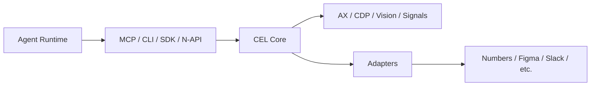

# CEL Runtime Architecture

> Current direction
> The active architecture is defined by [docs/adapters-cel-agents.md](./adapters-cel-agents.md).
> This document explains how that direction maps onto the current repository.

## Overview

Cellar should be understood as a three-layer system:

1. `Adapters` — app-specific truth and execution
2. `CEL / crates` — device understanding, context fusion, and execution substrate
3. `Agents` — pluggable planners and orchestrators

The repository's main value is not "a built-in planner."
The main value is:

- understanding the device honestly
- normalizing many signals into one usable context
- exposing stable actions and execution results
- routing work into the correct app substrate or adapter

## Layer 1: Adapters

Adapters are the extensibility layer.

They should let first-party and third-party developers add or extend support for applications like:

- Numbers
- Figma
- Slides
- Cursor
- Docker Desktop
- Slack
- richer browser/app domain integrations

Adapters own app-specific structured capabilities.

Examples:

- deterministic spreadsheet reads and writes
- domain-specific document APIs
- structured app state that generic AX or vision cannot expose well

AX, CDP, and generic system signals still matter, but adapters are where app truth should live when an app provides one.

## Layer 2: CEL / Crates

CEL is the platform core.

It owns:

- context fusion across AX, CDP, vision, signals, network, audio, and adapters
- canonical data types for context, actions, and results
- stream freshness and anomaly tracking
- adapter lifecycle and dispatch
- execution routing
- MCP / CLI / SDK / N-API surfaces
- memory and context management when they improve understanding and execution

It should remain valuable regardless of which agent runtime sits above it.

That means CEL should still make sense if the caller is:

- LangGraph
- Mastra
- Claude Code
- Codex
- GPT tool calling
- Gemini
- Cursor
- n8n
- a future in-house runtime

## Layer 3: Agents

Agents are clients of CEL.

They own:

- planning
- orchestration
- retries
- branching
- checkpointing
- human approval policies
- completion policies

The repo can include built-in planners and runners, but they should be treated as:

- reference implementations
- examples
- integration paths
- transitional code where useful

They should not define the platform boundary.

## Practical Boundary

The preferred boundary is:

In plain terms:

- agents ask CEL what the machine looks like
- agents ask CEL to execute actions
- CEL decides how to fulfill that action
- adapters provide app-specific truth where needed

## Numbers Example

Numbers is a good example of the intended split.

- AX should remain strong for window handoff, dialogs, focus, and generic desktop understanding.
- A `Numbers` adapter should own spreadsheet-model truth such as deterministic `write_cells` and future `read_cells`.

So the right approach is not "Numbers must be solved only through AX."
The right approach is:

- improve AX because it helps every desktop workflow
- add adapter-backed truth because spreadsheets are not a pure AX problem

## Current Repository Mapping

### Core CEL crates

- `cel-accessibility` — AX / desktop structure
- `cel-context` — context fusion and normalization
- `cel-cortex` — execution routing, runtime state, adapter dispatch
- `cel-input` — input primitives and app scripting bridges
- `cel-cdp` — browser/CDP substrate
- `cel-signals` / `cel-network` / `cel-display` / `cel-vision` — supporting streams
- `cel-napi` — native boundary for JS/TS callers

### Adapter surface

- `adapters/` — app/domain-specific integrations
- app-specific execution helpers in core crates are acceptable when they are clearly adapter-like, but they should evolve toward explicit adapter surfaces
- two languages share one `AdapterDriver` contract: native Rust adapters
  (`adapters/numbers`, `adapters/excel`, `adapters/sap-gui`,
  `adapters/bloomberg`, `adapters/metatrader`, `adapters/browser-rs`) run
  in-process via the cortex tick loop; TypeScript adapters
  (`adapters/browser`) run out-of-process via `ProcessDriver` and are used
  by the LangGraph runtime
- browser perception specifically is provided by **two** parallel adapters
  (`adapters/browser` TS, `adapters/browser-rs` Rust) because the LangGraph
  and canonical runtimes have different IPC budgets — see
  `docs/adapters-cel-agents.md` § "Browser perception" for the
  unification roadmap

### Agent integrations

- `agent/` — JS/TS agent integrations and runtime experiments
- `mcp-server/` — tool surface for external agents
- `cli/` — local entrypoints and debugging surfaces
- `cel-planner` / `cel-goal-runner` — built-in planner/runner implementations that may continue to exist, but should be viewed as clients of CEL rather than the platform's identity

## Evaluation Strategy

Evals should primarily test CEL and adapters.

That means:

- prefer agent-agnostic scenarios when possible
- focus on context quality, grounding, handoff reliability, and execution truth
- isolate runtime-specific acceptance tests under clearly named folders

The main eval question should be:

"Can a competent external agent use CEL to do this task?"

not:

"Did our preferred planner implementation pass?"

## Design Rules

1. Keep contracts stable.
   Context, actions, results, and adapter interfaces matter more than planner internals.

2. Keep planning pluggable.
   Adding one more planner integration is acceptable. Baking the whole architecture around one is not.

3. Prefer app truth over UI guessing.
   If an app exposes a structured model, use an adapter.

4. Keep the generic substrate strong.
   AX, signals, CDP, and fusion quality still matter for all apps, including apps with adapters.

5. Treat built-in planners as optional.
   They can be good products, examples, or benchmarks, but they are not the main moat right now.
